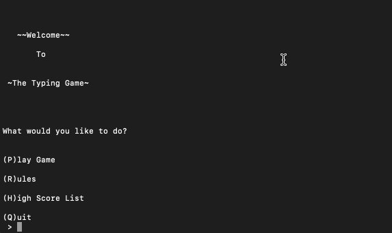

## Typr

This repository is a Python based game to help users to type faster, and more accurately. Here's how it works:

The Python script chooses a random sentence from a quote list and the player has to match the sentence exactly, and then outputs the amount of time taken as well as the total WPM (Words Per Minute).

When playing, the game will ask the user to type a sentence exactly. The program will then return the amount of time taken to type the phrase, print the WPM (Words Per Minute) of the player, and the percent accurracy of the player's sentence compared to the original. 

There is also a high scores list that keeps track of all the scores entered. When viewing the high scores in the game, it will automatically sort them by words per minute(WPM) and return back to the user in a well-formmated table.

## How to Play:

Just follow the in-game directions! The Letter at the beginning of each menu key indicates what button to press for one particular choice.

Note: Game is compatible with Python 3.

<b><u> Have fun! </u></b> 
